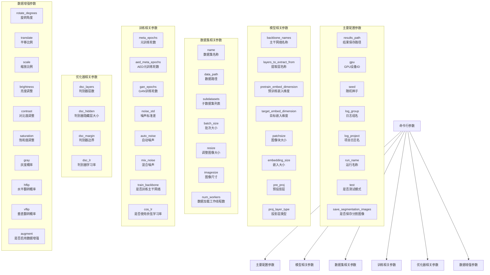

# SimpleNet


**SimpleNet: A Simple Network for Image Anomaly Detection and Localization**

*Zhikang Liu, Yiming Zhou, Yuansheng Xu, Zilei Wang**

[Paper link](https://openaccess.thecvf.com/content/CVPR2023/papers/Liu_SimpleNet_A_Simple_Network_for_Image_Anomaly_Detection_and_Localization_CVPR_2023_paper.pdf)

##  Introduction

This repo contains source code for **SimpleNet** implemented with pytorch.

SimpleNet is a simple defect detection and localization network that built with a feature encoder, feature generator and defect discriminator. It is designed conceptionally simple without complex network deisng, training schemes or external data source.

## Get Started 

### Environment 

**Python3.8**

**Packages**:
- torch==1.12.1
- torchvision==0.13.1
- numpy==1.22.4
- opencv-python==4.5.1

(Above environment setups are not the minimum requiremetns, other versions might work too.)


### Data

Edit `run.sh` to edit dataset class and dataset path.

#### MvTecAD

Download the dataset from [here](https://www.mvtec.com/company/research/datasets/mvtec-ad/).

The dataset folders/files follow its original structure.

### Run

#### Demo train

Please specicy dataset path (line1) and log folder (line10) in `run.sh` before running.

`run.sh` gives the configuration to train models on MVTecAD dataset.
```
bash run.sh
```

## Citation
```
@inproceedings{liu2023simplenet,
  title={SimpleNet: A Simple Network for Image Anomaly Detection and Localization},
  author={Liu, Zhikang and Zhou, Yiming and Xu, Yuansheng and Wang, Zilei},
  booktitle={Proceedings of the IEEE/CVF Conference on Computer Vision and Pattern Recognition},
  pages={20402--20411},
  year={2023}
}
```

## Acknowledgement

Thanks for great inspiration from [PatchCore](https://github.com/amazon-science/patchcore-inspection)

## License

All code within the repo is under [MIT license](https://mit-license.org/)

# 以下是我补充的内容

## 训练
### 预期输入

目录结构
`mvtec/<class>/train`

命令
`net/dataset`两个子命令

### 预期输出
```c
results/
└─ project/group/run_name/
   ├─ models/
   │  └─ 0/
   │     ├─ ckpt.pth          # 判别器+投影层权重
   │     └─ params.pkl        # patch 大小、通道数等超参
   ├─ tensorboard/            # 训练曲线
   └─ results.csv             # AUROC 汇总
```

## 推理

```python
score, mask = net.predict(img)
net.load_from_path('./results/.../models/0') 
```

## 全部参数

